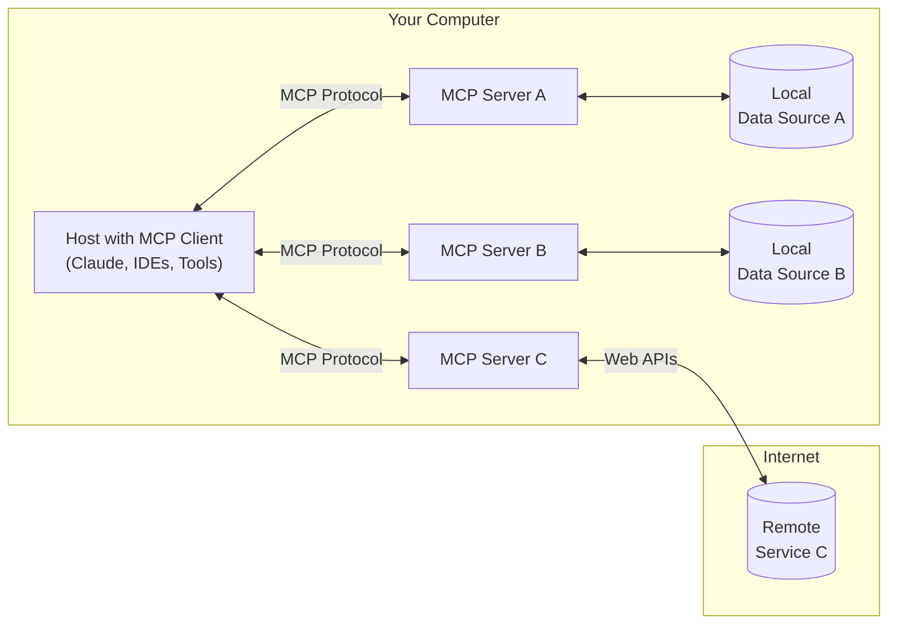

## Step 1: MCP/MCPサーバーとは何か？どんなことができるのか？

### 1.1 MCP（Model Context Protocol）  
  AI エージェントと外部リソース間の通信を標準化するオープンプロトコルです。USB-C ポートが様々なデバイスを統一的に接続するように、MCP は L⁠L⁠M と各種データソース・ツールを一貫したフォーマットでやり取りすることができます。

### 1.2 MCP サーバー  
  MCP プロトコルに準拠し、AI モデルからのリクエスト（ファイル操作、API 呼び出し、データベースアクセスなど）を受け取り、安全かつ一貫したフォーマットで実行する軽量コンポーネントです。

### 1.3 なぜ MCP が必要か？  
  主に以下のようなメリットがあります｡  
  - **拡張性**: あらかじめ用意されたプラグイン／統合（データベース、ファイルシステム、外部 API など）により、LLMは多様なリソースへ即座にアクセス可能  
  - **プロバイダ独立性**: LLM プロバイダを切り替えても同じインターフェイスで利用でき、ベンダーロックインを回避  
  - **セキュリティ**: データアクセス権限や監査ログを集中管理し、機密情報の取り扱いを安全に制御

  LLM（大規模言語モデル）は、あくまで推論器であり、外部リソースや文脈情報を直接取得する能力を持ちません。そのため、MCP サーバーは、LLM が必要とする文脈情報を効率的に収集・統合する役割を担います。例えば、ユーザーの入力内容に基づいて関連するデータベース情報やファイル内容を取得し、それを LLM に提供することで、より正確で適切な応答を生成することができるようになります。

### 1.4 一般的なアーキテクチャ  
  1. **MCP Hosts**: Claude Desktop や IDE など、MCP を介してデータへアクセスしたいアプリケーション  
  2. **MCP Clients**: ホストと 1:1 接続を維持するプロトコルクライアント  
  3. **MCP Servers**: 各種機能を標準化されたエンドポイントとして提供する軽量プログラム  
  4. **ローカルデータソース**: ファイルシステム、DB、OS サービスなど  
  5. **リモートサービス**: Web API やクラウドサービスなどの外部システム

引用: [Model Context Protocol - General Architecture](https://modelcontextprotocol.io/introduction#general-architecture)

※ 図が表示されない場合は、VS Code の拡張機能「Markdown Preview Mermaid Support」をダウンロードしてください。

### 1.5 MCP サーバーの活用

MCP サーバーを活用した実用的な例を紹介します。

1. **データ統合と分析の自動化**  
   複数のデータソース（ローカルファイル、データベース、外部 API など）からデータを収集し、AI モデルで分析を行うシステムを構築できます。例えば、販売データ、在庫情報、天候データを統合して需要予測を行うといった活用が考えられます。
2. **カスタム AI ツールの作成**  
   MCPサーバーを通じて、AI モデルがファイル操作や API 呼び出しを行えるようにし、特定の業務に特化したカスタム AI ツールを作成できます。例えば、問い合わせメールを解析し、関連する FAQ を自動検索して返信するシステムを構築できます。
3. **IoT デバイスの管理**  
   MCP サーバーを介して、IoT デバイスのデータを収集・管理するシステムを構築できます。例えば、スマートホームデバイスからセンサーデータを収集し、AI モデルで異常検知をしたり、機器の操作を自然言語で行うことができます。

これらの例は、MCPサーバーの柔軟性と拡張性を活かした活用方法を示しています。ぜひ、自身のプロジェクトに応用してみてください。

### 参考

- https://modelcontextprotocol.io/introduction
