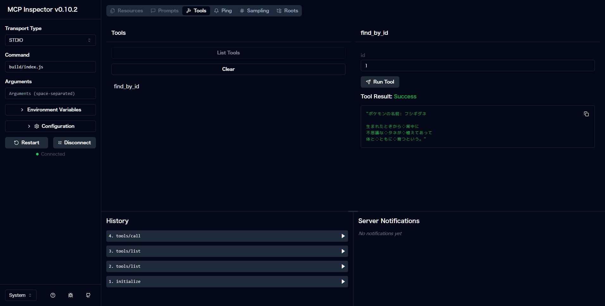

# Step 4: MCP サーバーのツール実装

### 4.1. **サーバーのインスタンス化**

  ```ts
  const server = new McpServer({
    name: "Pokémon Flavor Text",
    version: "1.0.0",
  });
  ```

  > [!NOTE]  
  > - `name` と `version` はクライアント側に見える情報です。  
  > - ここでは「Pokémon Flavor Text」というツール名でバージョン 1.0.0 を設定しています。

### 4.2. **ツール（エンドポイント）の定義**

  ```ts
  server.tool(
    "find_by_id",                       // ツール名
    { id: z.number().min(1).max(151) }, // 引数のスキーマや値検証ルール
    async ({ id }) => {                 // ハンドラ関数
      // ここに処理を実装
    }
  );
  ```

  - 第1引数：クライアントから呼び出す際の名前  
  - 第2引数：Zod で定義したパラメータ検証ルール  
  - 第3引数：実際にリクエストを受け取ったときに動く非同期関数

### 4.3. **PokéAPI からデータを取得**

  ツールのハンドラ内に以下を実装します。

  ```ts
  const response = await fetch(
    `https://pokeapi.co/api/v2/pokemon-species/${id}`
  );
  if (!response.ok) {
    throw new Error("Failed to fetch data from PokéAPI");
  }
  const pokemon = await response.json();
  ```

  > [!NOTE]  
  > - `fetch` で HTTP リクエストを送り、ステータスコードが 200 番台でない場合は例外を投げます。  
  > - `await response.json()` で JSON をパースして JavaScript オブジェクトに変換します。

### 4.4. **日本語のフレーバーテキストと名前を抽出**

  ```ts
  // flavor_text_entries の中から language.name === "ja" の最初のものを探す
  const flavorText = pokemon.flavor_text_entries.find(
    (entry: any) => entry.language.name === "ja"
  )?.flavor_text;

  // names の中から language.name === "ja" の名前を取得
  const name = pokemon.names.find(
    (entry: any) => entry.language.name === "ja"
  )?.name;
  ```

  > [!NOTE]  
  > - フレーバーテキストは配列の中から日本語 (`"ja"`) のエントリを探しています。  
  > - 名前も同様に `names` 配列から日本語のものを抽出します。  
  > - `?.` を使うことで、もし見つからなければ `undefined` になります（必要に応じてフォールバックを追加しても OK）。

### 4.5. レスポンス形式の組み立て

  ```ts
  const result = `ポケモンの名前: ${name}\n\n${flavorText}`;

  return {
    content: [
      { type: "text", text: result }
    ]
  };
  ```

  > [!NOTE]  
  > - MCP プロトコルでは、返り値として `content` プロパティを持つオブジェクトを返します。  
  > - `content` は配列で、各要素に `{ type: "text", text: "…" }` の形式で自由にメッセージを構築できます。

### 4.6. サーバー起動

  標準入出力トランスポートをサーバーに登録し、サーバーを開始します。

  ```ts
  // 標準入出力でリクエストを受ける設定
  server.transport(new StdioServerTransport());

  // サーバー起動
  server.listen();
  ```

### 4.7. ビルドと動作確認

  - `index.ts` をビルド

    ```bash
    npm run build
    ```

  - ビルド後の JavaScript を Node.js で起動

    ```bash
    npm run inspector
    ```

  - 動作確認

    - ブラウザで `http://127.0.0.1:6274` にアクセス
    - `Connect` ボタンを押下して MCP サーバーと接続
    - `List Tools` ボタン → `find_by_id` を選択
    - 右ペインの `find_by_id` → `id` テキストボックスに「1」と入力して `Run Tool` を実行
    - 以下のような状態になっていれば正常に動作しています

    
---

これで MCP サーバーが動作するようになりました。しかし、このままでは MCP サーバーがどのような機能を有しているのか、どのような値を受け入れるのかなど、細かい情報を LLM が読み取ることができません。  
次のステップでは、LLM がより正確に機能を把握できるように MCP サーバーのメタ情報を定義していきます。


## 補足

### サーバー機能について
ハンズオンではツールのみの利用でしたが、他にもプロンプトとリソースという機能があります。それぞれの用途と簡単な説明を以下にまとめます。

1. **ツール（Tools）**  
  クライアントが直接呼び出せるエンドポイントを定義します。  
  例えば、データベースクエリの実行、ファイル操作、外部 API 呼び出しなど、具体的なタスクを実行するための機能です。    

2. **プロンプト（Prompts）**  
  LLM に対して、特定のタスクを実行するための指示や文脈、つまり適切な応答を生成するためのガイドラインを提供します。  
  例えば、ユーザー入力を補完するためのテンプレートや、特定のフォーマットでの応答を促すための設定です。  

3. **リソース（Resources）**  
  外部データや設定情報を提供します。  
  例えば、ローカルのファイルシステムやクラウド上のストレージなどの静的なデータセットを取得するなど、ツールやプロンプトが利用するための補助的な情報を管理します。  

### PokéAPI について
今回使った PokéAPI の詳細です。レスポンスは JSON というデータ形式で定義されています。  
- [pokemon-species](https://pokeapi.co/docs/v2#pokemon-species)  

JSON とは何か？については、[JavaScript Primer](https://jsprimer.net/basic/json/) がわかりやすくおすすめです。  
以下はハンズオンで取得した JSON の必要箇所だけを抜き出したものです。  

```json
{
  "flavor_text_entries": [
    {
      "flavor_text": "生まれたときから　背中に\n不思議な　タネが　植えてあって\n体と　ともに　育つという。",
      "language": {
        "name": "ja",
        "url": "https://pokeapi.co/api/v2/language/11/"
      },  
      "version": {
        "name": "x",
        "url": "https://pokeapi.co/api/v2/version/23/"
      }
    }
  ],
  "names": [
    {
      "language": {
        "name": "ja",
        "url": "https://pokeapi.co/api/v2/language/11/"
      },
      "name": "フシギダネ"
    }
  ]
}
```
