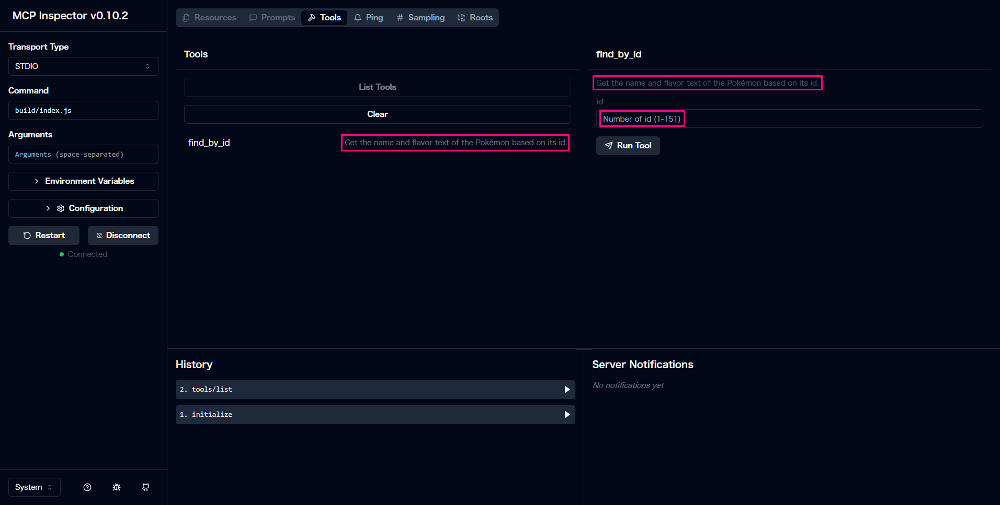

# Step 5: ツールのメタ情報の定義

### 5.1 メタ情報を定義する意味
  MCP クライアントは、ツール実行前にツールの一覧情報や、メタデータを取得します。これにより、利用可能なツール名や各ツールの概要説明、入力スキーマといった情報を把握し、どのツールを呼び出すべきかを判断できるようになります。  
  クライアントはまず ListToolsRequestSchema に基づいてサーバーへ一覧取得リクエストを送り、返却された tools 配列から必要なツールを選択。その後、選んだツールの名前と適切な引数を指定して実際の処理を実行します。  
  これにより、LLM は事前にツールの概要や入力仕様といった必要なコンテキストを手に入れたうえで、外部機能を正確に呼び出せるようになります。

### 5.2. ツール一覧要求（ListTools）用のハンドラを登録

```ts
server.server.setRequestHandler(
  ListToolsRequestSchema,
  async () => ({
    tools: [{
      name: "find_by_id",
      description: "Get the name and flavor text of the Pokémon based on its id.",
      inputSchema: {
        type: "object",
        properties: {
          id: {
            type: "number",
            description: "Number of id (1-151)",
            minimum: 1,
            maximum: 151
          }
        },
        required: ["id"]
      }
    }]
  })
);
```

- **`server.server`**  
  `new McpServer()` で作成したインスタンスの内部の、より低レイヤーなサーバーオブジェクトにアクセスしています。  
- **`setRequestHandler(ListToolsRequestSchema, handler)`**  
  - `ListToolsRequestSchema` は「どのリクエストが来たらこのハンドラを呼ぶか」を定義した Zod スキーマ。  
  - これによって、クライアント（例: Claude Desktop）から「利用可能なツール一覧を教えて」と言われたときに、このハンドラが実行されます。  
- **ハンドラ関数**  
  - `async () => ({ tools: [...] })` の返り値として、ツール一覧を含むオブジェクトを返却。  
  - `tools` 配列には、1つ以上のツール定義オブジェクトを置きます。

  各ツール定義オブジェクトの要素は以下の通りです:

  | プロパティ         | 説明                                                      |
  |--------------------|-----------------------------------------------------------|
  | `name`             | 先ほど `server.tool("find_by_id",…)` で定義したツール名   |
  | `description`      | ツールの概要説明。ユーザー（AI）が選ぶ際のヒントになる    |
  | `inputSchema`      | JSON Schema 形式で「どんな入力を受け付けるか」を定義      |
  | └ `properties.id`  | `id` フィールドの型・説明・制約（1〜151の数値）           |
  | └ `required`       | 必須入力フィールド。ここでは `id` が必須であることを設定  |

### 5.3. 定義した情報を確認する

  すべて設定したら、ステップ 4 で実行したコマンドを使って、ビルドと MCP Inspecotr を起動します。
  
  - `index.ts` をビルド
  
    ```bash
    npm run build
    ```

  - ビルド後の JavaScript を Node.js で起動

    ```bash
    npm run inspector
    ```
 
  - 動作確認

    - ブラウザで `http://127.0.0.1:6274` にアクセス
    - `Connect` ボタンを押下して MCP サーバーと接続
    - `List Tools` ボタンを押下
    - ツールリストやテキストボックスにコードで定義した情報が表示されていれば正しく設定できています。

    

---

これで、クライアントに MCP サーバーの機能について詳細を伝えられるようになりました。これでポケモンの名前とフレーバーテキストが取得できる MCP サーバーは完成です。  
次のステップでは、この MCP サーバーを Claude Desktop に繋いでポケモンを検索してみましょう。
