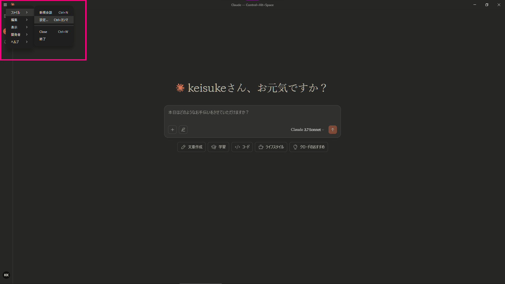
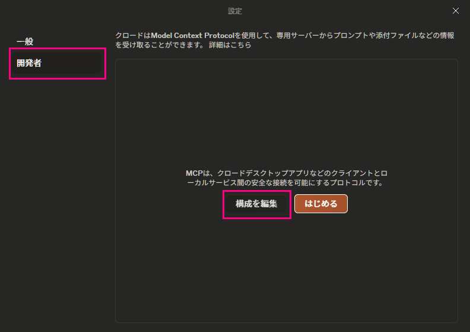
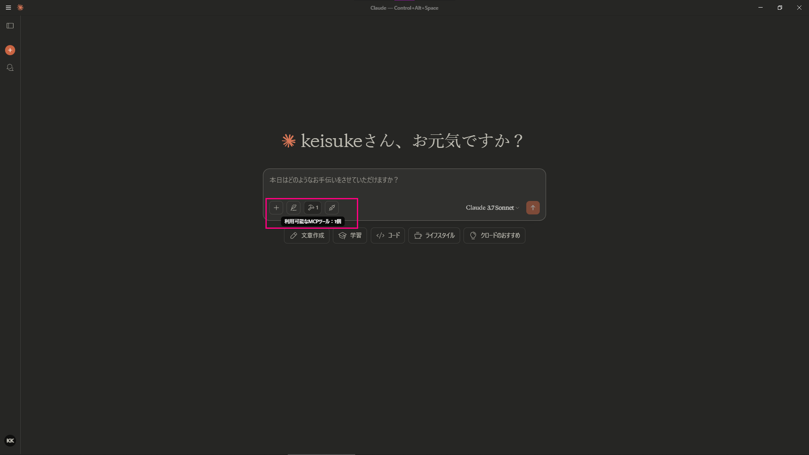
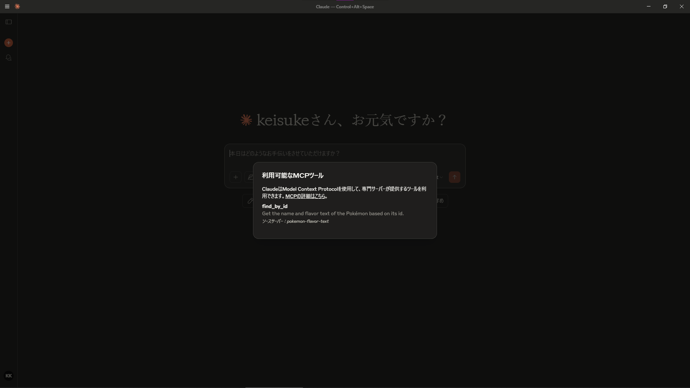
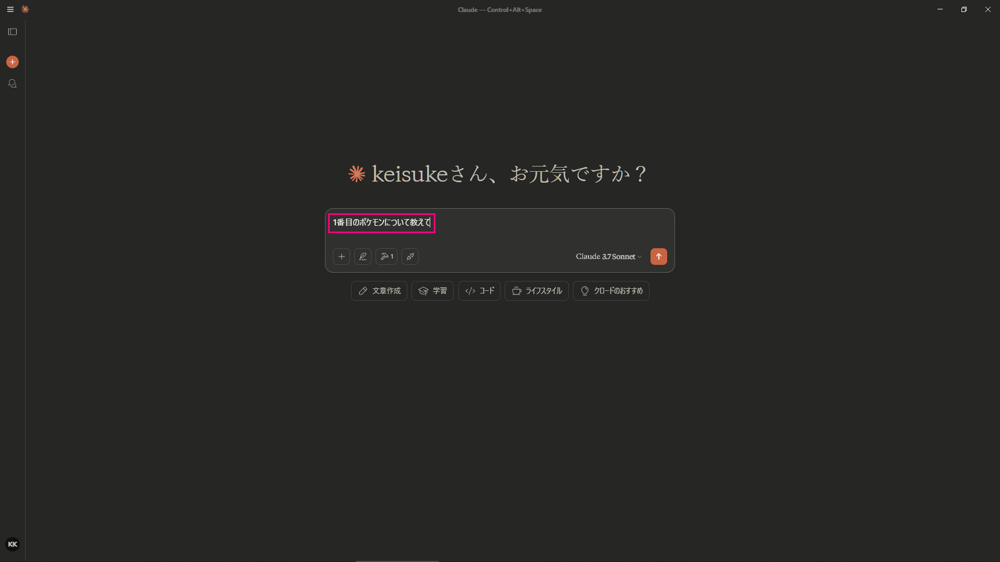
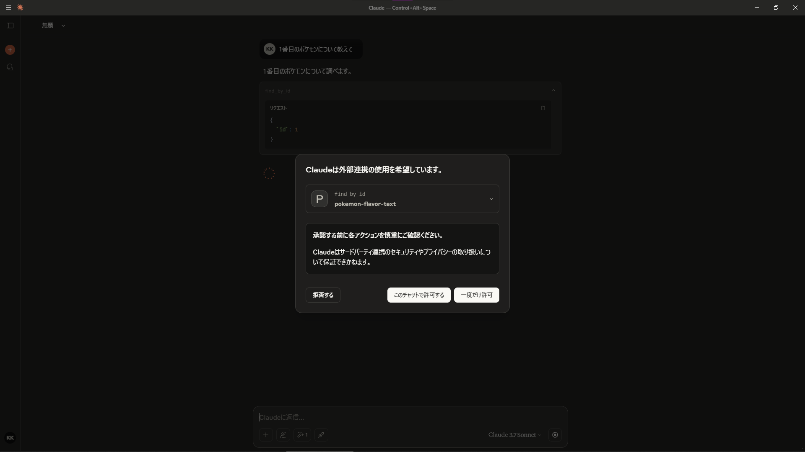
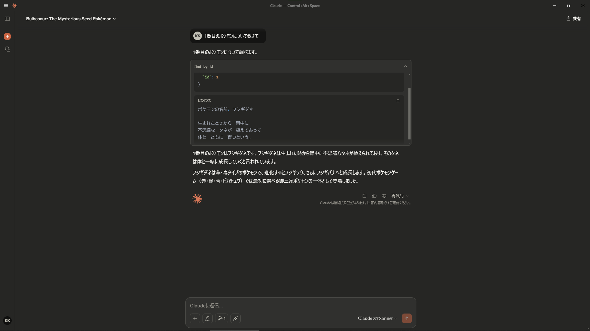

# Step 6: Claude Desktop から MCP サーバーに接続

### 6.1. Claude Desktop の設定を開く  
  左上のハンバーガーアイコンをクリックして、「**ファイル > 設定**」を開いてください。  

  

### 6.2. 開発者向けの構成ファイルを開く  
  「**開発者 > 構成を編集**」をクリックして、Claude Desktop の設定データが保存されているフォルダを開き、**`claude_desktop_config.json`** を VSCode などのエディタで開きます。  

    

### 6.3. MCP サーバーを登録する  
  ファイルを以下のように編集します。`args` の値は `build\index.js` の絶対パスを指定します。  
  VSCode のターミナルを開き、`E:\workspace\mcp-server-hands-on>` と表示されている `>` を除いた部分がこのプロジェクトの場所を表しています。  
  
  ```json
  {
    "mcpServers": {
      "pokemon-flavor-text": {
        "command": "node",
        "args": [
          "E:\\workspace\\mcp-server-hands-on\\build\\index.js"
        ]
      }
    }
  }
  ```

  ファイルを保存したら、Claude Desktop を一度終了して、再度起動します。  
  テキストボックス左下の金槌アイコンの横に数字が表示されているはずです。金槌アイコンをクリックして、`fid_by_id` と表示されていれば正しく設定されています。  

    

    

### 6.4. Claude Desktop で動作確認  
  1 番目のポケモンについて、Claude Desktop に聞いてみましょう。  

    

  MCP サーバーを使用していいか聞かれるので、「このチャットで許可する」か「一度だけ許可」を押してください。  

    

  API にアクセスしてデータが取得されています。LLM からの出力も、 MCP サーバーから得られた情報を使っていそうな内容でした。  

      

## 補足
  `claude_desktop_config.json` の `command` に指定する文字列は、環境によっては絶対パスを指定する必要があるかもしれません。  
  Windows 環境であれば、PowerShell を開いて、`gcm node` と入力して実行してください。以下のような出力が得られるので、`Source` の値を入力してください。  

  ```powershell
  gcm node

  CommandType     Name                                               Version    Source
  -----------     ----                                               -------    ------
  Application     node.exe                                           22.14.0.0  C:\nvm4w\nodejs\node.exe
  ```